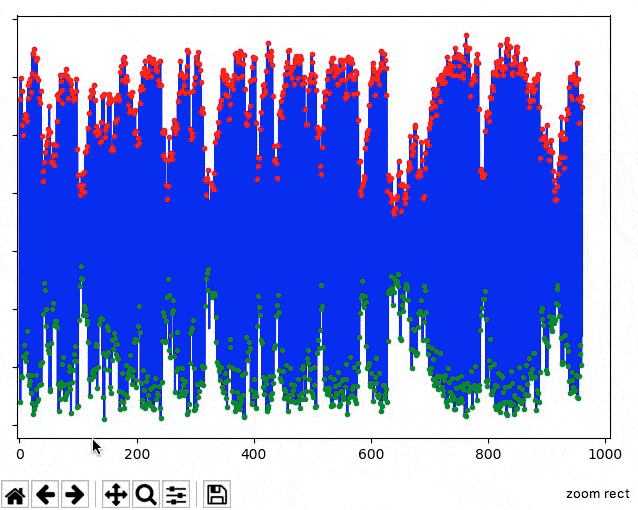

.. _usage_editing:

Manually editing data
---------------------

Physiological data are messy and prone to artifact (e.g., movement in
respiration and pulse, ectopic beats in ECG). Despite leaps and bounds in
recent algorithms for processing these data there still exists a need for
manual inspection to ensure such artifacts have been appropriately removed.

To do this reproducibly, however, we want to ensure there is a record of these
manual changes. The :py:func:`~.operations.edit_physio` function was designed
for this exact purpose. Invoking it will open up an interactive viewer that
allows you to remove peaks from noisy portions of the time series, or delete
peaks/troughs that were erroneously detected.

First, let's process some pulse photoplethysmography data collected at 25 Hz:

.. plot::
    :format: doctest
    :context: close-figs

    >>> from peakdet import load_physio, operations
    >>> data = load_physio('PPG.csv', fs=25.0)
    >>> data = operations.interpolate_physio(data, target_fs=250.0)
    >>> data = operations.filter_physio(data, cutoffs=1.0, method='lowpass')
    >>> data = operations.peakfind_physio(data, thresh=0.1, dist=100)
    >>> ax = operations.plot_physio(data)
    >>> ax.set_xlim(0, 10)  # doctest: +SKIP

The data looks good, but it would be nice to go through it all quickly and
ensure that there are no noisy sections or peaks/troughs that need to be
removed. We can do that easily with :py:func:`~.operations.edit_physio`:

.. plot::
    :format: doctest
    :context: close-figs
    :nofigs:

    >>> data = operations.edit_physio(data)

This function will open up an interactive viewer, which supports scrolling
through the time series (with the scroll wheel), rejection of noisy segments of
data (left click + drag, blue highlight), and deleting peaks / troughs that were
erroneously detected and shouldn't be considered at all (right click + drag,
red highlight):

If you accidentally reject or delete peaks, you can undo the selection with
``ctrl+z`` (or ``command+z`` if you're on a Mac). The interactive viewer will
track your history of edits as long as it is open, so you can undo multiple
selections, if desired. Once done, you can close the interactive viewer by
pressing ``ctrl+q`` (``command+q``).

All edits performed in the editor are stored in the :py:attr:`~.Physio.history`
of the data object, as with other operations, ensuring a record of your manual
changes are retained.
